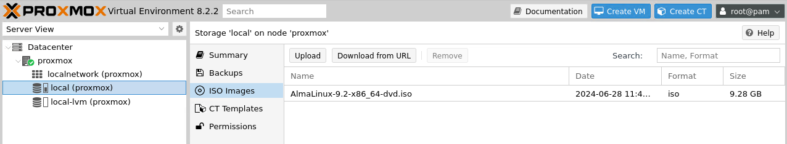
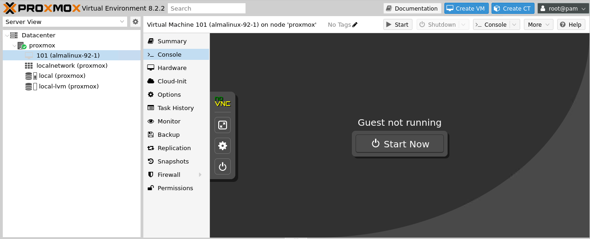
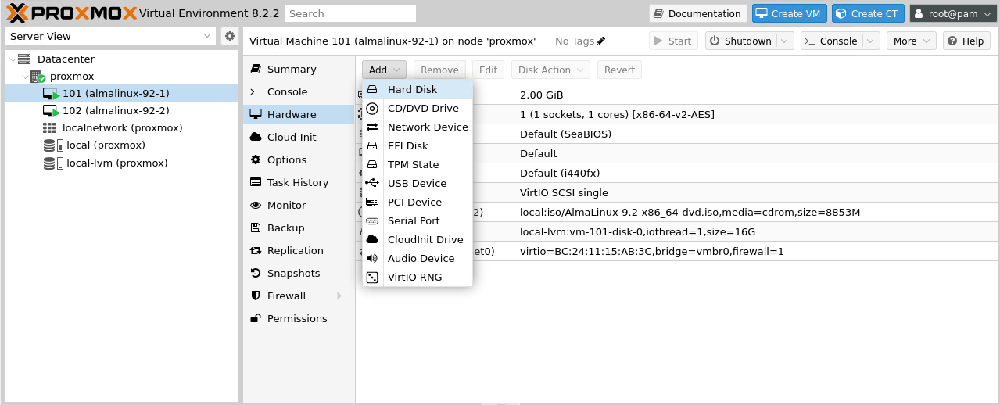

# How to setup a cluster with EXPRESSCLUSTER on VMs

## Virtual Machines spec

- OS: AlmaLinux OS 9.2
- RAM: 2GB
- System disk: 16GB
- Additional disk (for mirror disk): 2GB
  - CP: 1GB
  - DP: 1GB

## Procedures

1. Store an ISO file of Guest OS installer.

2. Create two VMs -- **101** and **102**.
   - General
     - Node: proxmox
     - VM ID: 101 / 102
     - Name: almalinux-92-1 / almalinux-92-2
   - OS
     - Use CD/DVD disc image file (iso)
       - Storage: local
       - ISO image: AlmaLinux-9.2-x86_64-dvd.iso
     - Guest OS:
       - Type: Linux
       - Version: 6.x - 2.6 kernel
   - System
     - Graphic card: Default
     - Machine: Default (i440fx)
     - BIOS: Default (SeaBIOS)
     - SCSI Controller: VirtIO SCSI single
   - Disk
     - Storage: local-lvm
     - Disk size (GiB): 16
   - CPU
     - Sockets: 1
     - Cores: 1
     - Type: x86-64-v2-AES
   - Memory
     - Memory (MiB): 2048
   - Network
     - Bridge: vmbr0
     - Model: VirtIO (paravirtualized)

3. Open a console of the created VM and start it.  
   Install AlmaLinux OS 9.2.

4. Add a hard disk to the VMs for mirror disk resource.

5. Connect to the VMs via SSH.

6. Setup EXPRESSCLUSTER.
   - (Let me skip the details of the setup procedure :p )
